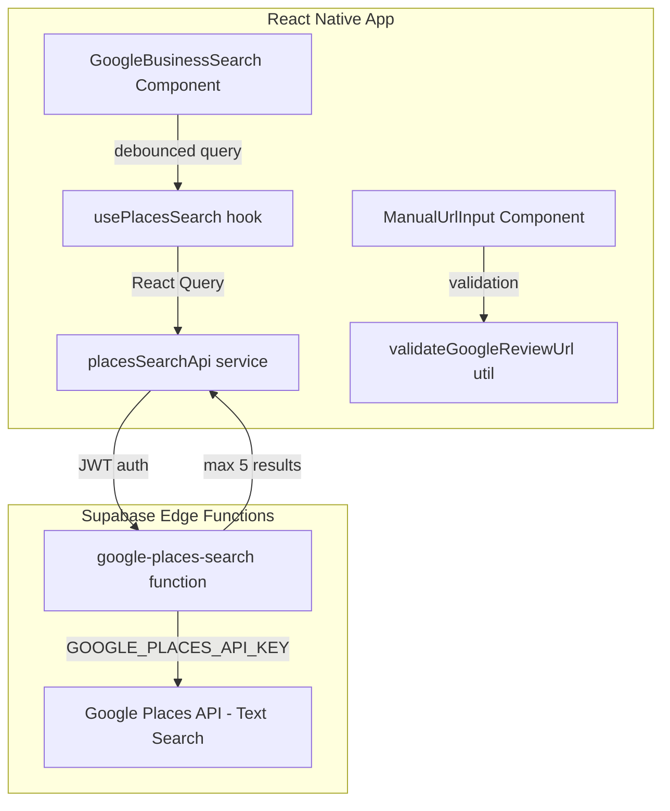

# Design Document: Google Review Link Enhancement

## Overview

This feature replaces the plain-text Google Review URL field with a search-first experience powered by the Google Places API (New). Business owners can find their listing by typing a business name — the app debounces keystrokes, queries a secure Supabase Edge Function proxy, and displays up to 5 matching results. Selecting a result auto-populates the business name and constructs the correct `https://search.google.com/local/writereview?placeid={PLACE_ID}` URL. A manual URL paste fallback with pattern validation remains for users who already have their link.

The enhancement applies to two surfaces: the signup form and the edit-business settings screen. Both share the same reusable component.

## Architecture



**Key architectural decisions:**

1. **Server-side proxy** — The Google Places API key never leaves the Edge Function. The client sends the user's JWT for auth; the proxy attaches the API key server-side.
2. **Reusable compound component** — A single `<GoogleReviewLinkPicker>` component encapsulates both the search experience and the manual URL fallback. It's used identically on signup and edit-business screens.
3. **React Query for search state** — Leverages existing `@tanstack/react-query` setup for caching, deduplication, and loading/error states. Search results are not persisted beyond the session.
4. **Client-side debounce + minimum character guard** — Prevents excessive API calls. The Edge Function also enforces the 3-character minimum as a defense-in-depth measure.

## Components and Interfaces

### Client Components

| Component | Responsibility |
|---|---|
| `GoogleReviewLinkPicker` | Compound container orchestrating search + manual entry. Emits `onBusinessConnected(data)` |
| `PlacesSearchField` | Text input with debounce logic, renders result list |
| `PlacesSearchResultItem` | Single result row: name, address, rating |
| `ManualUrlInput` | URL paste field with live validation |
| `ConnectedBusinessCard` | Displays currently connected business with "Change" action |

### Hook: `usePlacesSearch`

```typescript
interface UsePlacesSearchOptions {
  debounceMs?: number; // default 300
  minChars?: number;   // default 3
}

interface PlaceResult {
  placeId: string;
  name: string;
  formattedAddress: string;
  rating?: number;
}

interface UsePlacesSearchReturn {
  query: string;
  setQuery: (q: string) => void;
  results: PlaceResult[];
  isLoading: boolean;
  isError: boolean;
  error: Error | null;
}
```

### Utility: `buildGoogleReviewUrl`

```typescript
function buildGoogleReviewUrl(placeId: string): string {
  return `https://search.google.com/local/writereview?placeid=${placeId}`;
}
```

### Utility: `validateGoogleReviewUrl`

```typescript
function validateGoogleReviewUrl(url: string): boolean {
  // Accepts URLs containing:
  // - google.com/maps
  // - maps.google.com
  // - g.page
  // - search.google.com/local/writereview
  const patterns = [
    /^https?:\/\/(www\.)?google\.com\/maps/i,
    /^https?:\/\/maps\.google\.com/i,
    /^https?:\/\/(www\.)?g\.page/i,
    /^https?:\/\/search\.google\.com\/local\/writereview/i,
  ];
  return patterns.some((p) => p.test(url));
}
```

### Edge Function: `google-places-search`

| Method | Path | Auth | Request | Response |
|--------|------|------|---------|----------|
| POST | `/functions/v1/google-places-search` | Bearer JWT | `{ query: string }` | `{ results: PlaceResult[] }` or `{ error: { code, message } }` |

**Behavior:**
- Validates JWT via `createSupabaseClientWithAuth`
- Rejects queries < 3 characters with empty results
- Calls Google Places API (New) Text Search: `POST https://places.googleapis.com/v1/places:searchText`
- Maps response to `PlaceResult[]`, capped at 5
- Returns structured error if Google API fails

### Service Interface Extension

A new `IPlacesSearchService` interface is added to the service registry:

```typescript
interface IPlacesSearchService {
  search(query: string): Promise<Result<PlaceResult[]>>;
}
```

Added to `ServiceRegistry` as `placesSearch: IPlacesSearchService`.

## Data Models

### `PlaceResult` (API response DTO)

```typescript
interface PlaceResult {
  placeId: string;        // Google Place ID
  name: string;           // Business display name
  formattedAddress: string; // Human-readable address
  rating?: number;        // Google rating (1.0–5.0), undefined if unavailable
}
```

### Updated `BusinessProfile` (no schema change needed)

The existing `businessName` and `googleReviewUrl` fields on `BusinessProfile` are sufficient. No database migration required — the feature only changes how these values are populated.

### `GoogleReviewLinkPickerValue` (component output)

```typescript
interface GoogleReviewLinkPickerValue {
  businessName: string;
  googleReviewUrl: string;
  source: 'places_search' | 'manual_url';
}
```

## Correctness Properties

*A property is a characteristic or behavior that should hold true across all valid executions of a system — essentially, a formal statement about what the system should do. Properties serve as the bridge between human-readable specifications and machine-verifiable correctness guarantees.*

### Property 1: Debounce threshold prevents premature search

*For any* input string with fewer than 3 characters, the `usePlacesSearch` hook SHALL NOT trigger a search request to the proxy, regardless of how long the user waits after typing.

**Validates: Requirements 1.2, 3.6**

### Property 2: Google Review URL construction

*For any* valid Place ID string, `buildGoogleReviewUrl(placeId)` SHALL return a string equal to `https://search.google.com/local/writereview?placeid={placeId}` — a round-trip of parsing the returned URL and extracting the `placeid` query parameter SHALL yield the original Place ID.

**Validates: Requirements 1.5**

### Property 3: URL validation correctly classifies patterns

*For any* URL string that starts with `https://` and contains one of the accepted domain patterns (`google.com/maps`, `maps.google.com`, `g.page`, `search.google.com/local/writereview`), `validateGoogleReviewUrl` SHALL return `true`. *For any* URL string that does not match any accepted pattern, it SHALL return `false`.

**Validates: Requirements 2.3, 2.4, 2.5**

### Property 4: Proxy response transformation preserves required fields

*For any* valid Google Places API Text Search response containing place entries, the proxy's transformation logic SHALL produce an output array where every entry contains a non-empty `placeId`, non-empty `name`, non-empty `formattedAddress`, and `rating` (if present in the source).

**Validates: Requirements 3.1, 1.3**

### Property 5: Proxy result limiting invariant

*For any* Google Places API response containing N results (where N >= 0), the proxy SHALL return at most 5 entries. The returned entries SHALL be a prefix (first 5) of the full result set.

**Validates: Requirements 3.5**

### Property 6: Proxy rejects short queries without external call

*For any* search query string with fewer than 3 characters, the proxy SHALL return an empty result array and SHALL NOT invoke the Google Places API.

**Validates: Requirements 3.6**

### Property 7: Selection populates correct business name

*For any* `PlaceResult` selected by the user, the `GoogleReviewLinkPickerValue` emitted by the component SHALL have `businessName` equal to the `name` field of the selected result and `googleReviewUrl` equal to `buildGoogleReviewUrl(result.placeId)`.

**Validates: Requirements 1.5, 1.6, 4.3**

## Error Handling

| Scenario | Client Behavior | Proxy Behavior |
|----------|----------------|----------------|
| Google Places API error/timeout | Display "Search is temporarily unavailable. You can paste your Google Review link below." | Return `{ error: { code: "UPSTREAM_ERROR", message: "..." } }` with HTTP 502 |
| No results for query | Display "No businesses found. Try a different search or paste your Google Review link below." | Return `{ results: [] }` with HTTP 200 |
| Network unavailable (client offline) | Display "An internet connection is required to search. You can paste your Google Review link below." | N/A — request never reaches proxy |
| JWT missing or invalid | N/A — should not happen in normal flow | Return HTTP 401 `{ error: { code: "AUTH_ERROR", message: "..." } }` |
| Save fails (edit-business) | Display "Changes could not be saved. Please try again." and retain previous values | N/A |
| Query < 3 characters | Hook does not fire request; no UI feedback needed | Return empty results without calling Google API |

All error messages suggest the manual URL fallback as an alternative path.

## Testing Strategy

### Unit Tests (Example-Based)

- **Component rendering**: Verify `GoogleReviewLinkPicker` renders search field, "or" divider, and manual entry field
- **Loading state**: Verify loading indicator appears while search is in-flight
- **Confirmation message**: Verify "✓ Google Business connected successfully" after selection + save
- **Connected state**: Verify `ConnectedBusinessCard` shows current business with "Change" action
- **Error messages**: Verify each error scenario displays the correct message text
- **Form guard**: Verify save/continue button is disabled until valid selection or URL

### Property-Based Tests

Property-based testing is appropriate for this feature because the core logic involves pure functions (URL construction, URL validation, response transformation) and input-dependent behavior (debounce threshold, result limiting) where input variation reveals edge cases.

**Library**: `fast-check` (TypeScript property-based testing library)

**Configuration**: Minimum 100 iterations per property test.

**Tag format**: `Feature: google-review-link-enhancement, Property {N}: {description}`

| Property | What's Generated | What's Verified |
|----------|-----------------|-----------------|
| 1: Debounce threshold | Random strings of length 0–2 | No search request triggered |
| 2: URL construction | Random alphanumeric Place ID strings | Round-trip: URL → parse placeId param → equals original |
| 3: URL validation | Random URLs (mix of valid patterns + arbitrary strings) | Correct true/false classification |
| 4: Response transformation | Random Google Places API response objects | Output contains all required fields |
| 5: Result limiting | Arrays of 0–20 mock place entries | Output length <= 5 |
| 6: Short query guard | Random strings of length 0–2 | Empty result, no external call |
| 7: Selection populates | Random PlaceResult objects | Output matches expected name + constructed URL |

### Integration Tests

- **Edge Function end-to-end**: Deploy to local Supabase, send authenticated request, verify response shape
- **Signup flow**: Verify the enhanced field integrates with the existing form submission
- **Edit-business flow**: Verify updating via search result persists correctly
