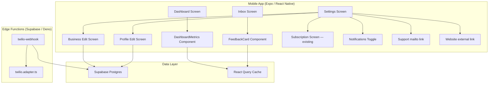

# Design Document: Launch-Ready Refinements

## Overview

This design specifies targeted refinements to make the Nudgli app launch-ready. Changes span five areas: dashboard metric card icons and labels, SMS messaging tone in the Twilio webhook, inbox simplification, settings page functional completeness, and elimination of dead-end UI. The existing architecture (React Native / Expo / NativeWind / Supabase / Twilio / Expo Router / React Query / service interfaces) remains unchanged — all work fits within established patterns.

### Goals
- Replace filled dashboard icons with clean outlined Ionicons in semantic-colored circles
- Rename "Needs Attention" to "Needs Follow-up" on the dashboard
- Rewrite Twilio webhook SMS response messages (warm tone for 4-5, empathetic acknowledgment for 1-3 without soliciting feedback)
- Remove any in-app messaging affordance from the inbox (keep Call Customer + Mark Resolved)
- Wire all Settings rows to functional screens (Business edit, Profile edit, Subscription nav, Notifications toggle, Support mailto, Website link)
- Ensure zero dead-end or placeholder elements remain in the app

### Non-Goals
- No new screens beyond business-edit and profile-edit
- No changes to the SMS sending flow, onboarding, auth, or subscription purchase logic
- No backend schema changes — all existing tables/columns are sufficient

---

## Architecture

The existing architecture stays intact. The refinement touches four layers:



### Change Surface

| Area | Files Modified | Files Created |
|------|---------------|---------------|
| Dashboard Icons | `src/features/dashboard/components/DashboardMetrics.tsx` | — |
| SMS Tone | `supabase/functions/_shared/adapters/twilio.adapter.ts` | — |
| Inbox | `src/features/inbox/components/FeedbackCard.tsx`, `src/app/(tabs)/inbox.tsx` | — |
| Settings | `src/app/(tabs)/settings.tsx` | `src/app/edit-business.tsx`, `src/app/edit-profile.tsx` |
| UX Polish | Various screens as needed | — |

---

## Components and Interfaces

### 1. DashboardMetrics Component (Modified)

**Current state:** Uses filled icons (`thumbs-up`, `alert-circle`, `pulse`).

**Target state:**
- Positive Responses: `checkmark-outline` icon inside a `bg-success-green/10` circle
- Needs Follow-up: `alert-circle-outline` icon inside a `bg-amber-100` (amber tint) circle
- Response Rate: `trending-up-outline` icon inside a `bg-blue-100` circle
- Rename label "Needs Attention" → "Needs Follow-up"

No interface changes. Props remain the same.

### 2. Twilio Adapter — SMS Response Builders (Modified)

**`buildPositiveResponse(googleReviewUrl: string): TwiMLResponse`**

New message (warm, genuine, mentions helping a small business):
> "Thanks so much — that really means a lot to us! If you have a moment, we'd love for you to share your experience on Google. It makes a huge difference for our small business: {googleReviewUrl}"

**`buildNegativeResponse(): TwiMLResponse`**

New message (empathetic, no feedback solicitation, promises follow-up):
> "Thank you for your honesty — we're sorry your experience didn't meet expectations. Someone from our team will reach out to you shortly to make things right."

The existing `handleAwaitingFeedbackText` flow and `buildThankYouResponse` are no longer reachable for new conversations because the negative response no longer asks for written feedback. The `awaiting_feedback_text` state handling remains in the webhook for backwards compatibility with in-flight conversations that were already in that state.

### 3. FeedbackCard Component (Unchanged)

Already provides Call Customer + Mark Resolved. No in-app text input exists. The component is already correct per requirements 8.2–8.4.

### 4. Inbox Screen (Minor Modification)

Verify no TextInput or message-send affordance exists. The current implementation already satisfies this — no changes needed beyond confirming there's no dead-end or placeholder element.

### 5. Settings Screen (Modified)

Replace the current read-only display with navigable rows:

| Row | Action | Icon |
|-----|--------|------|
| Business | Navigate to `/edit-business` | `business-outline` |
| User Profile | Navigate to `/edit-profile` | `person-outline` |
| Subscription | Navigate to `/subscription` | `card-outline` |
| Notifications | Toggle switch (in-row) | `notifications-outline` |
| Support | Open `mailto:support@nudgli.app` | `mail-outline` |
| Website | Open `https://nudgli.app` in browser | `globe-outline` |
| App Version | Display only (no action) | `information-circle-outline` |
| Log Out | Confirm + sign out | `log-out-outline` |

### 6. Edit Business Screen (New)

**Route:** `/edit-business`
**Fields:** Business Name (text), Google Review URL (text)
**Data source:** `useBusinessProfile()` hook
**Save:** `businessProfile.update({ businessName, googleReviewUrl })`

### 7. Edit Profile Screen (New)

**Route:** `/edit-profile`
**Fields:** First Name (text), Last Name (text), Email (read-only display)
**Data source:** `useBusinessProfile()` hook
**Save:** `businessProfile.update({ firstName, lastName })`

### 8. Notifications Toggle

Uses `expo-notifications` API:
- On toggle ON: `Notifications.requestPermissionsAsync()` → register token → save to `device_tokens` table
- On toggle OFF: remove token from `device_tokens` table → `Notifications.setNotificationHandler(null)`

State is derived from whether a valid push token exists for this device in the database.

---

## Data Models

No schema changes required. Existing models are sufficient:

### BusinessProfile (existing — no changes)
```typescript
interface BusinessProfile {
  id: string;
  authUserId: string;
  firstName: string;
  lastName: string;
  businessName: string;
  email: string;
  googleReviewUrl: string;
  subscriptionTier: SubscriptionTier;
  smsUsedThisPeriod: number;
  billingPeriodStart: Date;
  createdAt: Date;
  updatedAt: Date;
}
```

### FeedbackRecord (existing — no changes)
```typescript
interface FeedbackRecord {
  id: string;
  reviewRequestId: string;
  businessId: string;
  rating: number;
  feedbackText?: string;
  isResolved: boolean;
  resolvedAt?: Date;
  createdAt: Date;
}
```

### DashboardMetrics (existing — no changes)
```typescript
interface DashboardMetrics {
  reviewOpportunities: number;
  monthOverMonthChange: number | null;
  positiveResponses: number;
  needsAttention: number;
  requestsSent: number;
  responseRate: number | null;
}
```

### IBusinessProfileRepository (extended)

Add an `update` method to the existing interface:

```typescript
interface IBusinessProfileRepository {
  get(businessId: string): Promise<Result<BusinessProfile>>;
  getByAuthUserId(authUserId: string): Promise<Result<BusinessProfile>>;
  update(businessId: string, data: Partial<Pick<BusinessProfile, 'firstName' | 'lastName' | 'businessName' | 'googleReviewUrl'>>): Promise<Result<BusinessProfile>>;
}
```

---

## Correctness Properties

*A property is a characteristic or behavior that should hold true across all valid executions of a system — essentially, a formal statement about what the system should do. Properties serve as the bridge between human-readable specifications and machine-verifiable correctness guarantees.*

### Property 1: Month-over-month calculation correctness

*For any* pair of (currentMonthCount, previousMonthCount) where both are non-negative integers, the month-over-month percentage SHALL equal `round((current - previous) / previous * 100)` when previous > 0, and SHALL be null when previous is 0.

**Validates: Requirements 1.2, 1.3**

### Property 2: Feedback partitioning by rating threshold

*For any* set of feedback records with ratings in [1, 5] within the current month, the positive responses count SHALL equal the number of records with rating >= 4, and the needs-follow-up count SHALL equal the number of records with rating <= 3, and their sum SHALL equal the total number of feedback records.

**Validates: Requirements 2.1, 3.1**

### Property 3: Response rate calculation

*For any* pair of (totalResponses, totalRequestsSent) where both are non-negative integers, the response rate SHALL equal `round(totalResponses / totalRequestsSent * 100)` when totalRequestsSent > 0, and SHALL be null when totalRequestsSent is 0.

**Validates: Requirements 4.1, 4.2, 4.3**

### Property 4: Positive SMS response contains Google Review URL

*For any* valid URL string provided as the Google Review link, the TwiML response from `buildPositiveResponse` SHALL contain that exact URL string within its message body.

**Validates: Requirements 6.1, 6.2**

### Property 5: Negative SMS response excludes URLs and feedback solicitation

*For any* invocation of `buildNegativeResponse`, the TwiML response SHALL NOT contain any URL (http:// or https://) and SHALL NOT contain question marks or phrases soliciting written input.

**Validates: Requirements 7.2, 7.4**

### Property 6: Resolving feedback removes it from the unresolved set

*For any* feedback record that is unresolved, after calling `markResolved`, that record SHALL no longer appear in the set of unresolved feedback items for that business.

**Validates: Requirements 8.3**

---

## Error Handling

| Scenario | Handling |
|----------|----------|
| Business profile update fails (network/server) | Show inline error message below the save button, keep form data intact for retry |
| Profile update fails | Same pattern — inline error with retry |
| Notifications permission denied by OS | Show informational alert explaining how to enable in device settings; toggle reverts to off |
| Push token registration fails | Silent retry on next app launch; toggle shows "Enabled" only when token is confirmed stored |
| Linking.openURL fails (no email app, no browser) | Show Alert with "Unable to open {target}. Please try manually." |
| Twilio webhook receives malformed data | Return empty TwiML (existing behavior, unchanged) |
| Dashboard metrics query fails | React Query shows stale data if available; LoadingIndicator on first load; pull-to-refresh available |

---

## Testing Strategy

### Unit Tests (Example-Based)

Set up Jest + React Native Testing Library (not currently in devDependencies — needs to be added).

- **Dashboard icons:** Verify `DashboardMetrics` renders outlined icon names (`checkmark-outline`, `alert-circle-outline`, `trending-up-outline`)
- **SMS tone — positive:** Verify `buildPositiveResponse` output contains "means a lot", the Google URL, and "small business"
- **SMS tone — negative:** Verify `buildNegativeResponse` output contains "honesty", "reach out", does NOT contain "?", does NOT contain "http"
- **Settings rows:** Verify all rows render with correct labels and onPress handlers
- **Edit Business screen:** Verify form pre-fills from profile, save calls `update()`
- **Edit Profile screen:** Verify form pre-fills, email is read-only, save calls `update()`
- **Notifications toggle:** Verify toggle calls permission API on enable, removes token on disable

### Property-Based Tests

Use `fast-check` library for TypeScript property-based testing. Minimum 100 iterations per property.

| Property | Test Target | Generator |
|----------|-------------|-----------|
| 1: MoM calculation | `calculateMonthOverMonth(current, prev)` | `fc.nat()` pairs |
| 2: Feedback partitioning | Metrics filtering logic | `fc.array(fc.record({ rating: fc.integer({ min: 1, max: 5 }), createdAt: fc.date() }))` |
| 3: Response rate | Response rate formula | `fc.nat()` pairs |
| 4: Positive URL inclusion | `buildPositiveResponse(url)` | `fc.webUrl()` |
| 5: Negative excludes URLs | `buildNegativeResponse()` | No input variation (deterministic) — can still verify invariant |
| 6: Resolve removes from unresolved | Feedback repository mock | `fc.uuid()` for feedback IDs |

**Configuration:**
- Each property test runs minimum 100 iterations
- Tag format: `Feature: launch-ready-refinements, Property {N}: {title}`

### Integration Tests

- Settings → Edit Business → Save → verify Supabase upsert called
- Settings → Edit Profile → Save → verify Supabase upsert called
- Notifications toggle → verify expo-notifications API calls
- Support row → verify `Linking.openURL('mailto:support@nudgli.app')` called
- Website row → verify `Linking.openURL('https://nudgli.app')` called
