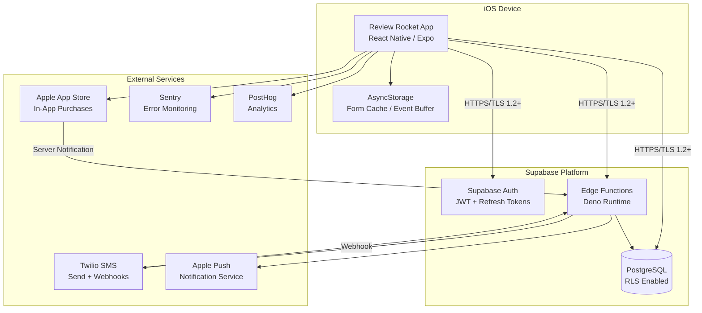
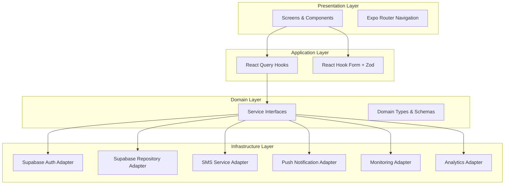
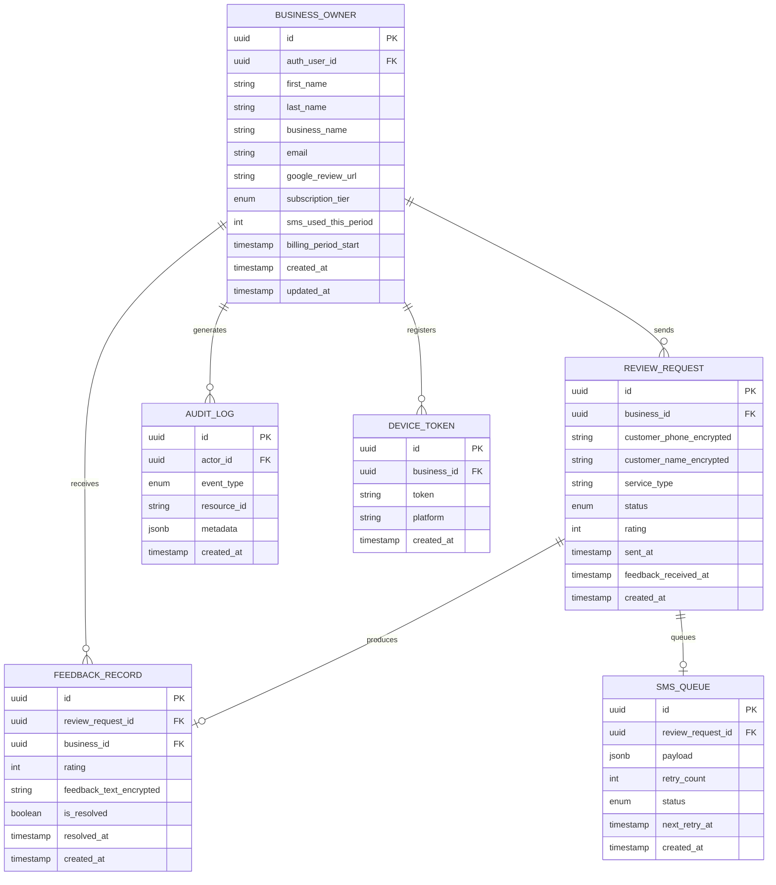

# Design Document: Review Rocket MVP

## Overview

Review Rocket is a production-quality iOS mobile application built with React Native, Expo, and TypeScript that helps single-owner local service businesses generate Google reviews through automated SMS feedback collection. The system follows a clean architecture pattern with service layer abstractions, enabling future migration from Supabase to AWS infrastructure.

The core flow:
1. Business owner registers and provides their Google Review URL
2. After completing a service, owner enters customer phone number in the app
3. A Supabase Edge Function triggers Twilio to send a feedback SMS
4. Customer replies with a 1-5 rating via SMS
5. Positive ratings (4-5) get a Google Review link; negative ratings (1-3) are routed to the owner's Inbox
6. Owner can call the customer or mark feedback as resolved

### Key Design Decisions

| Decision | Choice | Rationale |
|----------|--------|-----------|
| State management | React Query + local state | Server state caching with automatic invalidation; minimal client state needed |
| Form handling | React Hook Form + Zod | Performant forms with schema-based validation matching backend schemas |
| Styling | NativeWind (Tailwind) | Utility-first approach with shared theme config; familiar to web devs |
| Navigation | Expo Router | File-based routing with typed routes; tab preservation built-in |
| Backend | Supabase Edge Functions | Deno-based serverless; handles SMS orchestration and webhook processing |
| SMS | Twilio (Review Rocket owned) | Reliable SMS delivery with webhook support for inbound messages |
| Auth | Supabase Auth | JWT-based with refresh token rotation; future Cognito migration path |
| Subscriptions | Apple IAP | Required for iOS App Store; handles billing lifecycle |
| Abstraction | Service interfaces + Repository pattern | Decouples business logic from infrastructure; enables AWS migration |

## Architecture

### System Architecture Diagram



### Layered Architecture (Mobile App)



### Directory Structure

```
src/
├── app/                          # Expo Router file-based routes
│   ├── (auth)/                   # Auth group (login, signup, verify)
│   ├── (tabs)/                   # Authenticated tab navigation
│   │   ├── index.tsx             # Dashboard (Home tab)
│   │   ├── inbox.tsx             # Feedback Inbox tab
│   │   └── settings.tsx          # Settings tab
│   ├── send-request.tsx          # Send Review Request screen
│   └── _layout.tsx               # Root layout with auth guard
├── components/                   # Shared UI components
│   ├── ui/                       # Primitives (Button, Card, Input, Badge)
│   └── feedback/                 # Feedback-specific components
├── features/                     # Feature modules (co-located logic)
│   ├── auth/                     # Auth hooks, schemas, components
│   ├── dashboard/                # Dashboard hooks, components
│   ├── inbox/                    # Inbox hooks, components
│   ├── send-request/             # Send request hooks, schemas
│   └── subscription/             # Subscription hooks, components
├── services/                     # Service interface definitions
│   ├── interfaces/               # TypeScript interfaces
│   │   ├── auth.service.ts
│   │   ├── database.service.ts
│   │   ├── sms.service.ts
│   │   ├── notification.service.ts
│   │   ├── monitoring.service.ts
│   │   └── analytics.service.ts
│   └── index.ts                  # Service registry / DI container
├── infrastructure/               # Concrete implementations
│   ├── supabase/                 # Supabase adapters
│   │   ├── auth.adapter.ts
│   │   ├── repositories/        # Repository implementations
│   │   └── client.ts            # Supabase client initialization
│   ├── sentry/                   # Sentry adapter
│   ├── posthog/                  # PostHog adapter
│   └── notifications/            # Push notification adapter
├── types/                        # Shared TypeScript types & schemas
│   ├── domain.ts                 # Domain models
│   ├── api.ts                    # API request/response types
│   └── schemas.ts                # Zod validation schemas
├── utils/                        # Pure utility functions
│   ├── phone.ts                  # Phone number formatting/validation
│   ├── date.ts                   # Date utilities
│   └── metrics.ts                # Metric calculations
└── theme/                        # NativeWind theme configuration
    ├── colors.ts
    ├── spacing.ts
    └── typography.ts
```

### Edge Function Structure

```
supabase/
├── functions/
│   ├── send-sms/                 # Sends feedback request SMS
│   │   └── index.ts
│   ├── twilio-webhook/           # Handles inbound SMS replies
│   │   └── index.ts
│   ├── appstore-webhook/         # Handles App Store notifications
│   │   └── index.ts
│   └── _shared/                  # Shared utilities
│       ├── services/
│       │   ├── interfaces/       # Service interfaces (mirrors app)
│       │   ├── sms.service.ts
│       │   ├── feedback.service.ts
│       │   └── notification.service.ts
│       ├── adapters/
│       │   ├── twilio.adapter.ts
│       │   └── supabase.adapter.ts
│       ├── types/
│       └── utils/
```

## Components and Interfaces

### Service Interfaces

```typescript
// services/interfaces/auth.service.ts
export interface IAuthService {
  signUp(params: SignUpParams): Promise<Result<AuthUser>>;
  signIn(params: SignInParams): Promise<Result<AuthSession>>;
  signOut(): Promise<Result<void>>;
  refreshSession(): Promise<Result<AuthSession>>;
  requestPasswordReset(email: string): Promise<Result<void>>;
  getSession(): Promise<AuthSession | null>;
  onAuthStateChange(callback: (session: AuthSession | null) => void): Unsubscribe;
}

// services/interfaces/database.service.ts
export interface IReviewRequestRepository {
  create(request: CreateReviewRequestDTO): Promise<Result<ReviewRequest>>;
  findByPhoneNumberWithin24Hours(phone: string, businessId: string): Promise<Result<ReviewRequest | null>>;
  getRecentByBusiness(businessId: string, limit: number): Promise<Result<ReviewRequest[]>>;
  getMonthlyCount(businessId: string, monthStart: Date): Promise<Result<number>>;
  getPreviousMonthCount(businessId: string, prevMonthStart: Date, prevMonthEnd: Date): Promise<Result<number>>;
  updateWithRating(id: string, rating: number): Promise<Result<ReviewRequest>>;
}

export interface IFeedbackRepository {
  create(feedback: CreateFeedbackDTO): Promise<Result<FeedbackRecord>>;
  getUnresolved(businessId: string): Promise<Result<FeedbackRecord[]>>;
  getAll(businessId: string): Promise<Result<FeedbackRecord[]>>;
  markResolved(id: string): Promise<Result<FeedbackRecord>>;
  updateFeedbackText(id: string, text: string): Promise<Result<FeedbackRecord>>;
  getUnresolvedCount(businessId: string): Promise<Result<number>>;
}

export interface IBusinessProfileRepository {
  getByOwnerId(ownerId: string): Promise<Result<BusinessProfile>>;
  updateSubscriptionTier(businessId: string, tier: SubscriptionTier): Promise<Result<BusinessProfile>>;
  incrementSmsUsage(businessId: string): Promise<Result<number>>;
  resetSmsUsage(businessId: string): Promise<Result<void>>;
  getSmsUsage(businessId: string): Promise<Result<{ used: number; quota: number }>>;
}

// services/interfaces/sms.service.ts
export interface ISmsService {
  sendFeedbackRequest(params: SendSmsParams): Promise<Result<SmsDeliveryResult>>;
}

// services/interfaces/notification.service.ts
export interface INotificationService {
  registerDevice(token: string, userId: string): Promise<Result<void>>;
  requestPermission(): Promise<NotificationPermissionStatus>;
  getPermissionStatus(): Promise<NotificationPermissionStatus>;
  onNotificationReceived(callback: (notification: AppNotification) => void): Unsubscribe;
}

// services/interfaces/monitoring.service.ts
export interface IMonitoringService {
  captureException(error: Error, context?: ErrorContext): void;
  setUser(userId: string): void;
  clearUser(): void;
  addBreadcrumb(breadcrumb: Breadcrumb): void;
}

// services/interfaces/analytics.service.ts
export interface IAnalyticsService {
  trackEvent(event: AnalyticsEvent): void;
  trackScreenView(screenName: string): void;
  identify(userId: string, traits?: Record<string, unknown>): void;
  reset(): void;
}
```

### Result Type

```typescript
// types/result.ts
export type Result<T> =
  | { success: true; data: T }
  | { success: false; error: AppError };

export interface AppError {
  code: ErrorCode;
  message: string;
  details?: unknown;
}

export enum ErrorCode {
  NETWORK_ERROR = 'NETWORK_ERROR',
  VALIDATION_ERROR = 'VALIDATION_ERROR',
  AUTH_ERROR = 'AUTH_ERROR',
  RATE_LIMIT = 'RATE_LIMIT',
  QUOTA_EXCEEDED = 'QUOTA_EXCEEDED',
  NOT_FOUND = 'NOT_FOUND',
  CONFLICT = 'CONFLICT',
  SERVER_ERROR = 'SERVER_ERROR',
  UNKNOWN = 'UNKNOWN',
}
```

### React Query Hook Pattern

```typescript
// features/send-request/hooks/useSendReviewRequest.ts
export function useSendReviewRequest() {
  const smsService = useService<ISmsService>('sms');
  const reviewRequestRepo = useService<IReviewRequestRepository>('reviewRequests');
  const queryClient = useQueryClient();

  return useMutation({
    mutationFn: async (params: SendRequestFormData) => {
      const result = await smsService.sendFeedbackRequest({
        phoneNumber: params.phoneNumber,
        customerName: params.customerName,
        serviceType: params.serviceType,
      });
      if (!result.success) throw result.error;
      return result.data;
    },
    onSuccess: () => {
      queryClient.invalidateQueries({ queryKey: ['dashboard-metrics'] });
      queryClient.invalidateQueries({ queryKey: ['recent-activity'] });
    },
  });
}
```

### Edge Function — Twilio Webhook Handler

```typescript
// supabase/functions/twilio-webhook/index.ts
import { IFeedbackService } from '../_shared/services/interfaces/feedback.service.ts';

export async function handleInboundSms(
  feedbackService: IFeedbackService,
  smsService: ISmsService,
  payload: TwilioWebhookPayload
): Promise<TwiMLResponse> {
  const { From: phone, Body: body } = payload;

  const conversation = await feedbackService.getActiveConversation(phone);
  if (!conversation) return emptyResponse();

  // Check 72-hour expiry
  if (isExpired(conversation.createdAt, 72)) return emptyResponse();

  const rating = parseRating(body);

  if (conversation.state === 'awaiting_rating') {
    if (rating !== null) {
      await feedbackService.recordRating(conversation.id, rating);
      if (rating >= 4) {
        return smsService.buildPositiveResponse(conversation.googleReviewUrl);
      } else {
        return smsService.buildNegativeResponse();
      }
    } else {
      return feedbackService.handleInvalidResponse(conversation);
    }
  }

  if (conversation.state === 'awaiting_feedback_text') {
    const truncated = body.substring(0, 500);
    await feedbackService.recordFeedbackText(conversation.id, truncated);
    return smsService.buildThankYouResponse();
  }

  return emptyResponse();
}
```

### Key UI Components

| Component | Description | Props |
|-----------|-------------|-------|
| `DashboardMetrics` | Displays monthly counts grid | `metrics: DashboardMetricsData` |
| `RecentActivityFeed` | List of 10 most recent ratings | `items: ActivityItem[]` |
| `SendRequestForm` | Phone input + optional fields + submit | `onSubmit`, `isLoading` |
| `FeedbackCard` | Inbox card with actions | `feedback: FeedbackRecord`, `onCall`, `onResolve` |
| `SubscriptionTierPicker` | Three-tier selection with IAP | `currentTier`, `onSelect` |
| `ErrorBoundary` | Catches unhandled exceptions | `fallback: ReactNode` |
| `LoadingIndicator` | Consistent loading state | `size`, `color` |

## Data Models

### Entity Relationship Diagram



### Domain Types

```typescript
// types/domain.ts
export type SubscriptionTier = 'starter' | 'growth' | 'pro';

export const TIER_QUOTAS: Record<SubscriptionTier, number> = {
  starter: 250,
  growth: 1000,
  pro: 5000,
};

export interface BusinessProfile {
  id: string;
  authUserId: string;
  firstName: string;
  lastName: string;
  businessName: string;
  email: string;
  googleReviewUrl: string;
  subscriptionTier: SubscriptionTier;
  smsUsedThisPeriod: number;
  billingPeriodStart: Date;
  createdAt: Date;
  updatedAt: Date;
}

export type ReviewRequestStatus = 'sent' | 'delivered' | 'rating_received' | 'feedback_received' | 'failed' | 'expired';

export interface ReviewRequest {
  id: string;
  businessId: string;
  customerPhone: string;
  customerName?: string;
  serviceType?: string;
  status: ReviewRequestStatus;
  rating?: number;
  sentAt: Date;
  feedbackReceivedAt?: Date;
  createdAt: Date;
}

export interface FeedbackRecord {
  id: string;
  reviewRequestId: string;
  businessId: string;
  rating: number;
  feedbackText?: string;
  isResolved: boolean;
  resolvedAt?: Date;
  createdAt: Date;
}

export type AuditEventType = 'login' | 'sms_sent' | 'feedback_received' | 'feedback_resolved' | 'record_deleted';

export interface AuditLogEntry {
  id: string;
  actorId: string;
  eventType: AuditEventType;
  resourceId: string;
  metadata?: Record<string, unknown>;
  createdAt: Date;
}

export interface DashboardMetrics {
  reviewOpportunities: number;
  monthOverMonthChange: number | null; // null = N/A
  positiveResponses: number;
  needsAttention: number;
  requestsSent: number;
}

export interface ActivityItem {
  id: string;
  customerName?: string;
  rating: number;
  createdAt: Date;
}
```

### Zod Validation Schemas

```typescript
// types/schemas.ts
import { z } from 'zod';

const GOOGLE_REVIEW_URL_PATTERN = /^https?:\/\/(www\.)?(google\.com\/maps|maps\.app\.goo\.gl)\/.+/;

export const signUpSchema = z.object({
  firstName: z.string().min(1).max(50),
  lastName: z.string().min(1).max(50),
  businessName: z.string().min(1).max(100),
  email: z.string().email().max(254),
  password: z
    .string()
    .min(8)
    .max(128)
    .regex(/[A-Z]/, 'Must contain at least one uppercase letter')
    .regex(/[a-z]/, 'Must contain at least one lowercase letter')
    .regex(/[0-9]/, 'Must contain at least one number')
    .regex(/[^A-Za-z0-9]/, 'Must contain at least one special character'),
  googleReviewUrl: z.string().url().regex(GOOGLE_REVIEW_URL_PATTERN, 'Must be a valid Google Maps review link'),
});

export const sendRequestSchema = z.object({
  phoneNumber: z.string().regex(/^\(?[0-9]{3}\)?[-.\s]?[0-9]{3}[-.\s]?[0-9]{4}$/, 'Must be a valid US phone number'),
  customerName: z.string().max(50).optional().or(z.literal('')),
  serviceType: z.string().max(50).optional().or(z.literal('')),
});

export const ratingSchema = z.number().int().min(1).max(5);

export const feedbackTextSchema = z.string().max(500);

export type SignUpFormData = z.infer<typeof signUpSchema>;
export type SendRequestFormData = z.infer<typeof sendRequestSchema>;
```

### Database Schema (PostgreSQL / Supabase)

```sql
-- Enable RLS on all tables
ALTER TABLE business_owners ENABLE ROW LEVEL SECURITY;
ALTER TABLE review_requests ENABLE ROW LEVEL SECURITY;
ALTER TABLE feedback_records ENABLE ROW LEVEL SECURITY;

-- RLS Policies
CREATE POLICY "Users can only access own data"
  ON business_owners FOR ALL
  USING (auth_user_id = auth.uid());

CREATE POLICY "Users can only access own review requests"
  ON review_requests FOR ALL
  USING (business_id IN (SELECT id FROM business_owners WHERE auth_user_id = auth.uid()));

CREATE POLICY "Users can only access own feedback"
  ON feedback_records FOR ALL
  USING (business_id IN (SELECT id FROM business_owners WHERE auth_user_id = auth.uid()));

-- Indexes for common queries
CREATE INDEX idx_review_requests_business_sent ON review_requests(business_id, sent_at DESC);
CREATE INDEX idx_review_requests_phone_sent ON review_requests(customer_phone_encrypted, sent_at DESC);
CREATE INDEX idx_feedback_records_business_unresolved ON feedback_records(business_id, is_resolved, created_at DESC);
CREATE INDEX idx_audit_log_actor ON audit_log(actor_id, created_at DESC);
```

### Encryption Strategy

Sensitive fields (`customer_phone`, `customer_name`, `feedback_text`) are encrypted at the application level using AES-256-GCM before being stored. The encryption key is stored in Supabase Vault (environment secret), accessible only by Edge Functions. The mobile app never handles raw encryption keys — decryption occurs in Edge Functions which return plaintext only to authorized requests passing RLS checks.

## Correctness Properties

*A property is a characteristic or behavior that should hold true across all valid executions of a system — essentially, a formal statement about what the system should do. Properties serve as the bridge between human-readable specifications and machine-verifiable correctness guarantees.*

### Property 1: Signup schema validation

*For any* combination of form field values, the signup Zod schema SHALL accept the input if and only if: firstName is 1-50 characters, lastName is 1-50 characters, businessName is 1-100 characters, email is valid format and ≤254 characters, password is 8-128 characters containing at least one uppercase, one lowercase, one digit, and one special character, and googleReviewUrl matches the Google Maps URL pattern.

**Validates: Requirements 1.2, 1.4, 1.5**

### Property 2: Send request schema validation

*For any* string input, the send request Zod schema SHALL accept phoneNumber if and only if it is a valid US 10-digit number (with or without formatting characters), SHALL accept customerName if and only if it is empty or ≤50 characters, and SHALL accept serviceType if and only if it is empty or ≤50 characters.

**Validates: Requirements 3.2, 3.3**

### Property 3: SMS message formatting

*For any* business name and optional customer name, the formatted feedback request SMS SHALL contain the business name, a 1-5 rating instruction, and SHALL include the personalized greeting "Hi [Customer Name]" if and only if a customer name is provided.

**Validates: Requirements 4.1, 4.2**

### Property 4: Rating response routing

*For any* valid rating (1-5) and Google Review URL, the SMS response SHALL contain the Google Review URL if and only if the rating is 4 or 5, and SHALL contain the negative feedback prompt if and only if the rating is 1, 2, or 3.

**Validates: Requirements 4.3, 4.4**

### Property 5: Feedback text truncation

*For any* string input provided as customer feedback text, the stored text SHALL be identical to the input if the input length is ≤500 characters, and SHALL be the first 500 characters of the input if the input length exceeds 500 characters.

**Validates: Requirements 4.5, 4.6**

### Property 6: Invalid rating detection

*For any* SMS reply body that is not exactly one of the strings "1", "2", "3", "4", or "5", the rating parser SHALL classify it as invalid and the system SHALL respond with the retry prompt.

**Validates: Requirements 4.7**

### Property 7: Conversation expiry check

*For any* review request with a sent timestamp and any reply timestamp, the expiry check SHALL return true (expired) if and only if the reply timestamp is more than 72 hours after the sent timestamp.

**Validates: Requirements 4.10**

### Property 8: Month-over-month percentage calculation

*For any* pair of non-negative integers (currentCount, previousCount), the month-over-month function SHALL return null (N/A) if previousCount is 0, and SHALL return `round((currentCount - previousCount) / previousCount * 100)` otherwise.

**Validates: Requirements 5.3**

### Property 9: Activity feed sort and limit

*For any* list of activity items with timestamps, the activity feed function SHALL return at most 10 items, and those items SHALL be sorted by timestamp in descending order (newest first).

**Validates: Requirements 5.6**

### Property 10: Inbox filtering and sorting

*For any* collection of feedback records with varying ratings (1-5) and resolved states, the inbox filter SHALL return only records where rating ≤ 3 AND isResolved is false, sorted by createdAt descending.

**Validates: Requirements 6.1**

### Property 11: SMS quota state classification

*For any* pair of non-negative integers (used, quota) where quota > 0, the quota check SHALL classify the state as: "exceeded" if used ≥ quota, "warning" if used ≥ 0.8 * quota, and "ok" otherwise.

**Validates: Requirements 7.3, 8.3**

### Property 12: Data sanitization

*For any* data object potentially containing fields named customerPhone, customerName, or feedbackText, the sanitization function SHALL return a copy of the object with those fields removed or redacted, and all other fields preserved unchanged.

**Validates: Requirements 10.5, 14.1, 14.3**

### Property 13: Form cache management

*For any* sequence of cache write operations, the cache SHALL never store more than 50 pending requests, and SHALL exclude any requests older than 30 days when evaluating capacity.

**Validates: Requirements 11.3**

### Property 14: Exponential backoff calculation

*For any* retry attempt number n in {0, 1, 2}, the calculated backoff delay SHALL equal 1000 × 2^n milliseconds (1s, 2s, 4s).

**Validates: Requirements 11.4**

### Property 15: SMS queue retry eligibility

*For any* queued SMS request with a creation timestamp, the retry logic SHALL mark the request as eligible for retry if and only if fewer than 24 hours have elapsed since creation, and SHALL schedule the next retry exactly 5 minutes after the previous attempt.

**Validates: Requirements 11.6**

### Property 16: Event buffer management

*For any* sequence of monitoring/analytics events when the service is unreachable, the buffer SHALL store at most 100 events, dropping the oldest events when capacity is exceeded.

**Validates: Requirements 14.5**

## Error Handling

### Error Strategy Overview

The application uses a `Result<T>` type for all service operations, avoiding thrown exceptions in business logic. Unhandled exceptions are caught by React Error Boundaries at the screen level.

### Error Categories

| Category | Source | Handling |
|----------|--------|----------|
| Validation errors | Zod schemas, form input | Inline field-level messages, prevent submission |
| Network errors | HTTP failures, timeouts | Retry with exponential backoff (3 attempts), then user-facing error |
| Auth errors | Expired tokens, invalid credentials | Auto-refresh for token expiry; redirect to login on failure |
| Rate limit errors | Too many login attempts | Display lockout duration, disable form |
| Quota errors | SMS limit reached | Block send action, navigate to subscription screen |
| SMS delivery failures | Twilio errors | Queue for retry (5 min intervals, 24h max), notify owner on final failure |
| IAP failures | App Store purchase errors | Retain current tier, display cancellation message |
| Server errors | Edge Function 5xx | Log to Sentry with sanitized context, display generic error to user |

### Retry Strategy

```typescript
// utils/retry.ts
export interface RetryConfig {
  maxAttempts: number;       // 3
  baseDelayMs: number;       // 1000
  backoffMultiplier: number; // 2
}

export async function withRetry<T>(
  operation: () => Promise<Result<T>>,
  config: RetryConfig = { maxAttempts: 3, baseDelayMs: 1000, backoffMultiplier: 2 }
): Promise<Result<T>> {
  for (let attempt = 0; attempt < config.maxAttempts; attempt++) {
    const result = await operation();
    if (result.success) return result;
    if (attempt < config.maxAttempts - 1) {
      await delay(config.baseDelayMs * Math.pow(config.backoffMultiplier, attempt));
    }
  }
  return { success: false, error: { code: ErrorCode.NETWORK_ERROR, message: 'Operation failed after retries' } };
}
```

### Error Boundary Architecture

```typescript
// components/ErrorBoundary.tsx
// Wraps each tab screen. On unhandled exception:
// 1. Captures error to Sentry (with screen name, device info, anonymized user ID)
// 2. Renders a friendly error screen with "Restart" button
// 3. Restart navigates back to Dashboard
```

### SMS Queue Failure Handling

When Twilio is unavailable, the Edge Function writes to the `sms_queue` table. A scheduled function runs every 5 minutes, picking up queued items and retrying. After 24 hours (288 attempts max), the item is marked as `failed` and a push notification is sent to the business owner.

## Testing Strategy

### Testing Framework

| Layer | Tool | Purpose |
|-------|------|---------|
| Unit tests | Jest + React Native Testing Library | Component rendering, hook behavior, utility functions |
| Property tests | fast-check | Universal properties across generated inputs |
| Integration tests | Jest + MSW (Mock Service Worker) | API flow testing with mocked backends |
| E2E tests | Detox (future) | Full device simulation |

### Property-Based Testing Configuration

- **Library**: [fast-check](https://github.com/dubzzz/fast-check) (TypeScript-native PBT library)
- **Minimum iterations**: 100 per property test
- **Tag format**: `Feature: review-rocket-mvp, Property {N}: {property_text}`

Each correctness property from the design document maps to exactly one `fc.assert(fc.property(...))` test.

### Test Organization

```
__tests__/
├── properties/               # Property-based tests (1 file per property group)
│   ├── validation.property.test.ts    # Properties 1, 2
│   ├── sms-formatting.property.test.ts # Properties 3, 4, 5, 6
│   ├── conversation.property.test.ts   # Properties 7
│   ├── metrics.property.test.ts        # Properties 8, 9, 10, 11
│   ├── sanitization.property.test.ts   # Property 12
│   ├── cache-buffer.property.test.ts   # Properties 13, 16
│   └── retry-queue.property.test.ts    # Properties 14, 15
├── unit/                     # Example-based unit tests
│   ├── features/
│   │   ├── auth/
│   │   ├── dashboard/
│   │   ├── inbox/
│   │   └── send-request/
│   └── services/
├── integration/              # API flow tests with MSW
│   ├── auth.integration.test.ts
│   ├── send-request.integration.test.ts
│   └── feedback.integration.test.ts
└── setup/
    └── test-utils.ts         # Shared test utilities, service mocks
```

### Coverage Requirements

- **Business logic modules**: Minimum 70% line coverage (service implementations, utilities, hooks)
- **Infrastructure adapters**: Integration-tested but not included in coverage gate
- **UI components**: Snapshot tests for visual regression; interaction tests for critical flows

### Unit Test Focus Areas

- Specific examples demonstrating correct behavior (e.g., valid signup with known inputs)
- Edge cases: empty strings, boundary lengths, null customer names
- Error condition handling (network failures, expired tokens)
- Integration points between services (mocked)

### CI/CD Integration

Tests run in the Expo EAS pipeline:
1. `npm run test:unit` — Jest unit tests
2. `npm run test:property` — fast-check property tests (100 iterations each)
3. `npm run test:integration` — Integration tests with MSW
4. Coverage report generated and gate enforced at 70%

