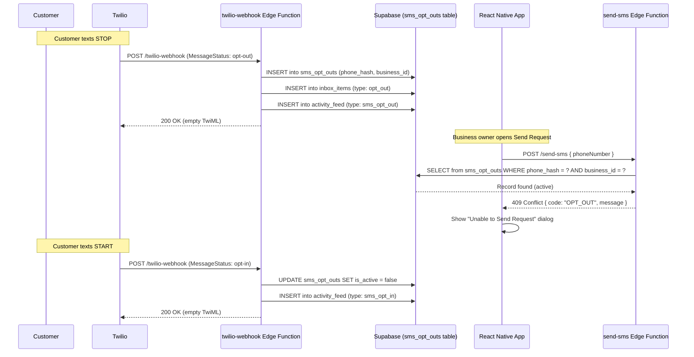

# Design Document: SMS Opt-Out Handling

## Overview

This feature adds SMS opt-out compliance handling to Nudgli. When Twilio detects a carrier-level STOP/UNSUBSCRIBE keyword from a customer, it sends a status callback to our webhook. The system must:

1. Record the opt-out status in Supabase (phone hash + business ID)
2. Create an informational Inbox item notifying the business owner
3. Log the event in the Activity Feed
4. Block outbound SMS sends to opted-out numbers (with a friendly dialog)
5. Reverse the opt-out when a customer texts START (opt-back-in)

Twilio already handles STOP/START keywords at the carrier level (blocking/unblocking delivery), but we must track this state in our database to provide UX feedback and prevent wasted API calls.

## Architecture



## Components and Interfaces

### 1. Database: `sms_opt_outs` Table

New Supabase table storing opt-out records.

```sql
CREATE TABLE sms_opt_outs (
  id UUID PRIMARY KEY DEFAULT gen_random_uuid(),
  business_id UUID NOT NULL REFERENCES business_owners(id) ON DELETE CASCADE,
  customer_phone_hash TEXT NOT NULL,
  customer_name_encrypted TEXT,
  is_active BOOLEAN NOT NULL DEFAULT true,
  opted_out_at TIMESTAMPTZ NOT NULL DEFAULT now(),
  opted_in_at TIMESTAMPTZ,
  created_at TIMESTAMPTZ NOT NULL DEFAULT now(),
  updated_at TIMESTAMPTZ NOT NULL DEFAULT now(),
  UNIQUE(business_id, customer_phone_hash)
);

CREATE INDEX idx_sms_opt_outs_lookup 
  ON sms_opt_outs(customer_phone_hash, business_id) 
  WHERE is_active = true;
```

### 2. Database: `inbox_items` Table

New generic inbox table to support multiple item types (feedback cards remain in `feedback_records`, but opt-out notifications live here).

```sql
CREATE TABLE inbox_items (
  id UUID PRIMARY KEY DEFAULT gen_random_uuid(),
  business_id UUID NOT NULL REFERENCES business_owners(id) ON DELETE CASCADE,
  type TEXT NOT NULL CHECK (type IN ('opt_out', 'system')),
  title TEXT NOT NULL,
  body TEXT NOT NULL,
  is_dismissed BOOLEAN NOT NULL DEFAULT false,
  metadata JSONB,
  created_at TIMESTAMPTZ NOT NULL DEFAULT now()
);

CREATE INDEX idx_inbox_items_active 
  ON inbox_items(business_id, created_at DESC) 
  WHERE is_dismissed = false;
```

### 3. Database: `activity_feed` Table

New table for a polymorphic activity feed supporting both rating-based entries and system events.

```sql
CREATE TABLE activity_feed (
  id UUID PRIMARY KEY DEFAULT gen_random_uuid(),
  business_id UUID NOT NULL REFERENCES business_owners(id) ON DELETE CASCADE,
  type TEXT NOT NULL CHECK (type IN ('rating', 'sms_opt_out', 'sms_opt_in')),
  customer_name TEXT,
  customer_phone_formatted TEXT,
  description TEXT NOT NULL,
  metadata JSONB,
  created_at TIMESTAMPTZ NOT NULL DEFAULT now()
);

CREATE INDEX idx_activity_feed_business 
  ON activity_feed(business_id, created_at DESC);
```

### 4. Backend: `twilio-webhook` Edge Function (Extended)

The existing webhook handler gains new logic to detect opt-out/opt-in status callbacks from Twilio. Twilio sends these as POST requests with specific `MessageStatus` or `OptOutType` fields.

**New responsibilities:**
- Detect `SmsStatus=undelivered` with `ErrorCode=21610` (opt-out) or check for `OptOutType` field
- Alternatively detect when `Body` contains STOP/UNSUBSCRIBE/CANCEL from a known customer
- On opt-out: create `sms_opt_outs` record, create `inbox_items` record, create `activity_feed` entry
- On opt-in (START): mark `sms_opt_outs` as inactive, create `activity_feed` entry
- Return empty TwiML (no reply to customer — Twilio already sends the carrier STOP confirmation)

**Interface addition to `supabase.adapter.ts`:**

```typescript
export async function createOptOutRecord(
  client: SupabaseClient,
  params: {
    businessId: string;
    customerPhoneHash: string;
    customerNameEncrypted?: string;
  }
): Promise<Result<{ id: string; created: boolean }>>;

export async function deactivateOptOutRecord(
  client: SupabaseClient,
  params: {
    businessId: string;
    customerPhoneHash: string;
  }
): Promise<Result<void>>;

export async function checkOptOutStatus(
  client: SupabaseClient,
  phoneHash: string,
  businessId: string,
): Promise<Result<boolean>>;

export async function createInboxItem(
  client: SupabaseClient,
  params: {
    businessId: string;
    type: 'opt_out' | 'system';
    title: string;
    body: string;
    metadata?: Record<string, unknown>;
  }
): Promise<Result<{ id: string }>>;

export async function createActivityFeedEntry(
  client: SupabaseClient,
  params: {
    businessId: string;
    type: 'rating' | 'sms_opt_out' | 'sms_opt_in';
    customerName?: string;
    customerPhoneFormatted?: string;
    description: string;
    metadata?: Record<string, unknown>;
  }
): Promise<Result<{ id: string }>>;
```

### 5. Backend: `send-sms` Edge Function (Extended)

Add an opt-out check **before** quota deduction and Twilio API call.

```typescript
// After phone hash computation, before quota check:
const optOutResult = await checkOptOutStatus(serviceClient, phoneHash, profile.id);
if (optOutResult.success && optOutResult.data === true) {
  return new Response(
    JSON.stringify({
      error: {
        code: "OPT_OUT",
        message: "This customer has opted out of receiving SMS messages.",
      },
    }),
    { status: 409, headers: { "Content-Type": "application/json" } },
  );
}
```

### 6. Frontend: SMS Service Interface Extension

```typescript
// src/types/result.ts — extend ErrorCode
export enum ErrorCode {
  // ... existing codes
  OPT_OUT = 'OPT_OUT',
}
```

The existing `ISmsService.sendFeedbackRequest()` already returns `Result<SmsDeliveryResult>`, so the client handles the error through the existing `result.error.code` pattern.

### 7. Frontend: Send Request Screen (Extended)

In `src/app/send-request.tsx`, handle the `OPT_OUT` error code by showing an Alert dialog:

```typescript
if (error.code === ErrorCode.OPT_OUT) {
  Alert.alert(
    'Unable to Send Request',
    'This customer has opted out of receiving SMS messages. To respect their communication preferences, Nudgli cannot send additional review requests unless they opt back in.',
    [{ text: 'OK', style: 'default' }],
  );
  return;
}
```

### 8. Frontend: Inbox Feature Extension

**New hook:** `useInboxItems` — fetches opt-out inbox items (non-dismissed) alongside existing feedback cards.

**New component:** `OptOutCard` — renders an informational-style card with:
- Ionicons `information-circle` icon in teal/blue
- Title: "Customer Opted Out"
- Body text with customer name or formatted phone
- Single "Dismiss" button

**Service interface extension:**

```typescript
// src/services/interfaces/database.service.ts
export interface IInboxItemRepository {
  getActive(businessId: string): Promise<Result<InboxItem[]>>;
  dismiss(itemId: string): Promise<Result<void>>;
}
```

### 9. Frontend: Activity Feed Extension

Extend `ActivityItem` type to support opt-out/opt-in entries:

```typescript
export interface ActivityItem {
  id: string;
  type: 'rating' | 'sms_opt_out' | 'sms_opt_in';
  customerName?: string;
  description: string;
  rating?: number;  // only for type 'rating'
  createdAt: Date;
}
```

Update `useRecentActivity` to fetch from the new `activity_feed` table (or a combined query) and the `RecentActivityFeed` component to render opt-out/opt-in items with an informational icon instead of stars.

### 10. Utility: Opt-Out Message Formatting

Pure function for generating inbox body and activity descriptions:

```typescript
export function formatOptOutInboxBody(customerName?: string, phoneFormatted?: string): string {
  const name = customerName || phoneFormatted || 'A customer';
  return `${name} has chosen to stop receiving SMS messages from your business. Future review requests cannot be sent to this phone number unless they opt back in.`;
}

export function formatOptOutActivityDescription(customerName?: string, phoneFormatted?: string): string {
  const name = customerName || phoneFormatted || 'A customer';
  return `${name} opted out of SMS messaging`;
}

export function formatOptInActivityDescription(customerName?: string, phoneFormatted?: string): string {
  const name = customerName || phoneFormatted || 'A customer';
  return `${name} opted back in to SMS messaging`;
}
```

## Data Models

### OptOutRecord

| Field | Type | Description |
|-------|------|-------------|
| id | UUID | Primary key |
| businessId | UUID | FK to business_owners |
| customerPhoneHash | string | Deterministic hash of normalized phone |
| customerNameEncrypted | string? | Encrypted customer name (if known) |
| isActive | boolean | true = opted out, false = opted back in |
| optedOutAt | Date | Timestamp of opt-out event |
| optedInAt | Date? | Timestamp of most recent opt-in |
| createdAt | Date | Row creation time |
| updatedAt | Date | Last modification time |

### InboxItem

| Field | Type | Description |
|-------|------|-------------|
| id | UUID | Primary key |
| businessId | UUID | FK to business_owners |
| type | 'opt_out' \| 'system' | Item category |
| title | string | Display title |
| body | string | Display body text |
| isDismissed | boolean | Whether user dismissed it |
| metadata | JSONB? | Extra data (e.g., phone hash for reference) |
| createdAt | Date | When the item was created |

### ActivityFeedEntry

| Field | Type | Description |
|-------|------|-------------|
| id | UUID | Primary key |
| businessId | UUID | FK to business_owners |
| type | 'rating' \| 'sms_opt_out' \| 'sms_opt_in' | Entry category |
| customerName | string? | Decrypted name (if available) |
| customerPhoneFormatted | string? | Formatted phone for display |
| description | string | Human-readable description |
| metadata | JSONB? | Extra context |
| createdAt | Date | Event timestamp |

## Correctness Properties

*A property is a characteristic or behavior that should hold true across all valid executions of a system — essentially, a formal statement about what the system should do. Properties serve as the bridge between human-readable specifications and machine-verifiable correctness guarantees.*

### Property 1: Opt-out record creation with correct fields

*For any* valid opt-out webhook notification (with a valid phone number and associated business), processing it SHALL produce an opt-out record containing a non-null timestamp, the correct phone hash, and the correct business identifier.

**Validates: Requirements 1.1, 1.2**

### Property 2: Opt-out idempotency

*For any* phone number and business combination, processing two identical opt-out notifications SHALL result in exactly one active opt-out record (no duplicates created).

**Validates: Requirements 1.3**

### Property 3: Malformed payload rejection

*For any* malformed or incomplete webhook payload (missing phone number, missing body, empty fields), the handler SHALL return HTTP 200 and SHALL NOT create any opt-out record, inbox item, or activity entry.

**Validates: Requirements 1.4**

### Property 4: Inbox item creation with correct format

*For any* opt-out event with a customer (who may or may not have a name on file), the system SHALL create an inbox item with title "Customer Opted Out" and a body containing either the customer name or the formatted phone number followed by the opt-out message.

**Validates: Requirements 2.1, 2.2**

### Property 5: Dismiss removes inbox item from active view

*For any* opt-out inbox item that is dismissed, querying the active inbox items SHALL NOT include that item.

**Validates: Requirements 2.4**

### Property 6: Activity entry creation with correct format and timestamp

*For any* opt-out event, the system SHALL create an activity feed entry with description "{Name} opted out of SMS messaging" (using customer name or formatted phone) and a valid timestamp matching when the opt-out occurred.

**Validates: Requirements 3.1, 3.2**

### Property 7: Activity feed chronological ordering

*For any* set of activity feed entries (of mixed types including opt-out, opt-in, and rating), the resulting list SHALL be sorted by timestamp in descending order (newest first).

**Validates: Requirements 3.4**

### Property 8: Send blocked and quota preserved for opted-out numbers

*For any* phone number with an active opt-out record, attempting to send a review request SHALL be blocked (return an error) AND the business owner's SMS quota counter SHALL remain unchanged.

**Validates: Requirements 4.1, 4.4**

### Property 9: Phone normalization equivalence

*For any* phone number expressed in different valid formats (e.g., "(555) 123-4567", "5551234567", "+15551234567"), the opt-out check SHALL produce the same result — ensuring that format variations do not bypass the opt-out block.

**Validates: Requirements 4.5**

### Property 10: Opt-in deactivates record

*For any* phone number with an active opt-out record, processing an opt-in notification SHALL mark that record as inactive (is_active = false) with a valid opted_in_at timestamp.

**Validates: Requirements 5.1**

### Property 11: Opt-out/Opt-in round trip restores send capability

*For any* phone number that has been opted out and then opted back in, the send-request flow SHALL allow sending review requests to that phone number (send is no longer blocked).

**Validates: Requirements 5.2**

### Property 12: Opt-in activity entry

*For any* opt-in event with a customer (who may or may not have a name on file), the system SHALL create an activity feed entry with description "{Name} opted back in to SMS messaging" using the customer name or formatted phone number.

**Validates: Requirements 5.3**

## Error Handling

| Scenario | Handling |
|----------|----------|
| Twilio sends malformed opt-out callback | Log error, return 200 to Twilio (never return errors to Twilio or it retries) |
| Database write fails when creating opt-out record | Log error, return 200 to Twilio. The opt-out is still enforced at Twilio's carrier level. Retry on next callback if Twilio sends another. |
| Inbox/activity creation fails after opt-out record saved | Non-fatal. The opt-out record is the source of truth. Inbox/activity are informational — missing entries don't affect compliance. |
| `checkOptOutStatus` query fails in send-sms | Fail open with a logged warning. Allow the send — Twilio will reject it at the carrier level anyway, and the business owner won't be confused by a false opt-out block. |
| Opt-in received but no existing opt-out record | No-op. Return 200 to Twilio. |
| Customer name lookup fails during formatting | Fall back to formatted phone number for display. |

## Testing Strategy

### Unit Tests (Example-Based)

- Opt-out webhook parsing: verify correct extraction of phone/status from Twilio POST body
- `formatOptOutInboxBody`: specific examples with name, without name, with various phone formats
- `formatOptOutActivityDescription` / `formatOptInActivityDescription`: specific examples
- Send request screen: verify Alert.alert is called with correct title/body/buttons when `OPT_OUT` error received
- OptOutCard component: renders informational style (blue/teal icon, not red), shows "Dismiss" button
- Activity feed rendering: opt-out items render with info icon, not star rating

### Property-Based Tests

Property-based testing is well-suited for this feature because:
- The formatting functions are pure and vary meaningfully with input (names, phone numbers)
- The opt-out check logic is pure (hash-based lookup, normalization)
- Idempotency and round-trip properties are classic PBT patterns

**Library:** [fast-check](https://github.com/dubzzz/fast-check) (already available in the TypeScript ecosystem, compatible with Vitest)

**Configuration:** Minimum 100 iterations per property test.

**Tag format:** `Feature: sms-opt-out-handling, Property {N}: {title}`

Properties to implement:
1. Opt-out record creation correctness (P1)
2. Opt-out idempotency (P2)
3. Malformed payload rejection (P3)
4. Inbox item format correctness (P4)
5. Dismiss removes from active (P5)
6. Activity entry format and timestamp (P6)
7. Chronological ordering invariant (P7)
8. Send blocked + quota unchanged (P8)
9. Phone normalization equivalence (P9)
10. Opt-in deactivation (P10)
11. Opt-out/opt-in round trip (P11)
12. Opt-in activity entry format (P12)

### Integration Tests

- End-to-end webhook flow: POST a Twilio-format opt-out payload → verify database records created
- End-to-end send-sms with opted-out number: verify 409 response
- End-to-end opt-in flow: opt-out → opt-in → send succeeds

### Design Decisions

1. **Separate `sms_opt_outs` table vs. flag on `review_requests`:** A dedicated table is cleaner because opt-out is per-phone-per-business, not per-request. A customer may have multiple past requests but one opt-out status.

2. **New `inbox_items` table vs. reusing `feedback_records`:** Opt-out notifications are fundamentally different from feedback (no rating, no resolution flow). A generic inbox table supports future system notification types.

3. **New `activity_feed` table vs. extending the existing approach:** The current activity feed derives from `review_requests` with ratings. Opt-out/opt-in events don't have ratings. A polymorphic `activity_feed` table provides a single source for all activity types, simplifying the query.

4. **HTTP 409 for opt-out block (vs. 403 or 422):** 409 Conflict semantically fits — the request conflicts with the current state of the target resource (the customer's opt-out preference).

5. **Fail-open on `checkOptOutStatus` errors:** Twilio already enforces STOP at the carrier level. A database error shouldn't block the UX — the message will be rejected by the carrier anyway, and we log the issue for investigation.

6. **UNIQUE constraint on (business_id, customer_phone_hash):** Enforces idempotency at the database level. The `ON CONFLICT` clause handles re-processing gracefully.
